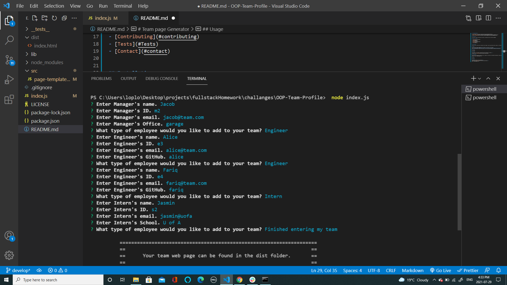

# Team page Generator

## Description

This app will creates a Team Page! Just Answer a few prompts and viola a brand new webpage!

## Table of Contents

- [Installation](#installation)
- [Usage](#usage)
- [Credits](#credits)
- [License](#license)
- [Contributing](#contributing)
- [Tests](#Tests)
- [Contact](#contact)

## Installation

Clone this repo, insure node is installed on your computer, install inquirer and jest (npm install inquirer) in terminal/bash.

## Usage

Once set up just type in command line "node index.js" and answer all the prompts!

Watch a video demo here: https://drive.google.com/file/d/1bd-NmOSVe06TvRy2DhJjno22TKPt6Ek6/view?usp=sharing

## Credits

Jacob Banks

## License

This project is [MIT](https://choosealicense.com/licenses/mit/) licensed. 
Copyright © 2021 [JACOB BANKS](https://github.com/jacob-banks)

## Contributing

Please feel free to add to or adjust any file. Looking for the ability to edit/delete team members. Please contact me for more info. Email kobyBanks@gmail.com

## Tests

npm tests

## Contact

Contact Jacob Banks with any questions! 
Github link: [jacob-banks](https://github.com/jacob-banks) 
Email: kobybanks@gmail.com
